# 9.22 notes

* 用pt和sppm渲染了大部分pbrt-v4 scenes
  * 云、雾没有涉及
* pt参数：默认depth=5，spp=64
* sppm参数：默认depth=5，iterations=64，每个像素每次iteration约2个photon

## 汇总表格

* 注：户外/室内的界定标准，是无穷远处是否有光源

| 场景                  | pt耗时 | sppm耗时 | 场景特征                                             | pt                 | sppm                                           | 对比 |
| --------------------- | ------ | -------- | ---------------------------------------------------- | ------------------ | ---------------------------------------------- | ---- |
| bistro_vespa          | 456    | 421      | 户外，欧式小镇街头                                   | 一般               | 阴影处噪点非常多                               | >    |
| bmw-m6                | 121    | 129      | 户外，一辆宝马车，地板glossy材质                     | 一般               | glossy材质/玻璃处噪点多；阴影处噪点多          | >    |
| contemporary-bathroom | 390    | 424      | 室内，光源来自一扇窗和几个微小灯泡，浴缸有水，大镜子 | 阴影过多           | 场景明亮很多，可以看到微小灯泡散发出的光       | <    |
| crown                 | 262    | 327      | 户外，一个镶满宝石的皇冠                             | 一般               | 一般但噪点略多。两颗透明宝石无法正常渲染出颜色 | >    |
| killeroo-simple       | 107    | 173      | 户外，两个diffuse材质的袋鼠                          | 一般               | 噪点过多，阴影过暗                             | >    |
| kroken-camera-1       | 2829   | 2412     | 室内，左侧有大面积光源，有躺椅，架子上有很多小摆件   | 明亮+噪点多        | 场景偏暗+噪点少，两个相框无法正常渲染          | ?    |
| pbrt-book             | 111    | 173      | 户外，一本书                                         | 一般               | 阴影处噪点多                                   | >    |
| sportscar-area        | 150    | 219      | 面光源，一辆车，充满glossy材质；地板diffuse材质      | 噪点略多           | 噪点比pt多一点                                 | ≈    |
| sportscar-sky         | 130    | 153      | 户外，一辆车，充满glossy材质；地板diffuse材质        | 一般               | 玻璃处存在一些噪点                             | >    |
| watercolor-camera-1   | 1118   | 1087     | 室内，阁楼，阁楼侧面有一扇大窗户                     | 一般，存在一些噪点 | 一般，阴影偏暗                                 | >    |
| zero-day-frame120     | 318    | 444      | 室内，偏镜面glossy材质                               | 噪点很多           | 存在噪点，但是比pt会好非常多                   | <    |

## 场景

* 都是先pt再sppm

### bistro_vespa

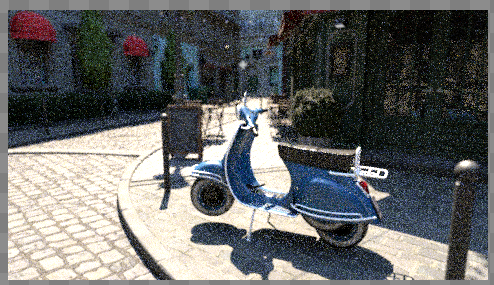 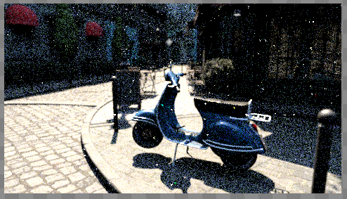

### bmw-m6

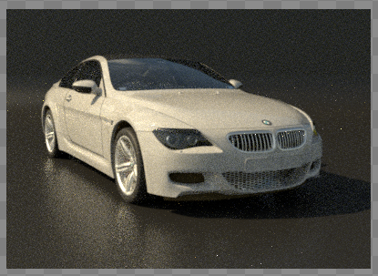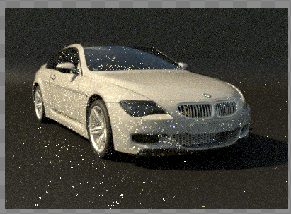

### contemporary-bathroom

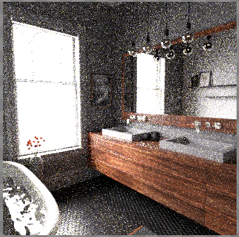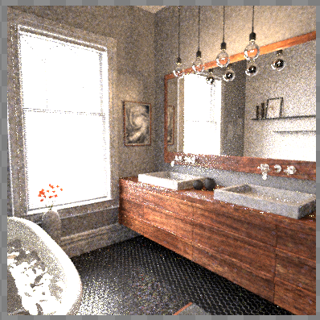

### crown

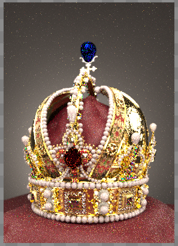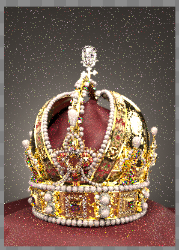

### killeroo-simple

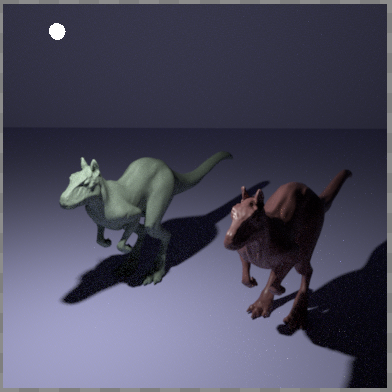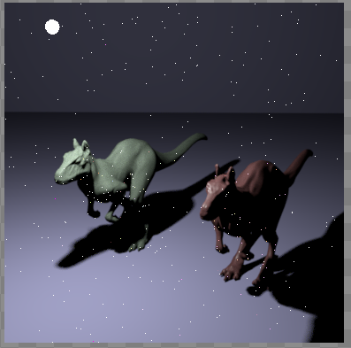

### kroken-camera-1

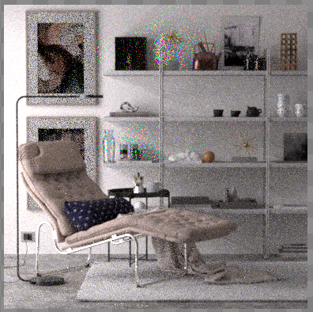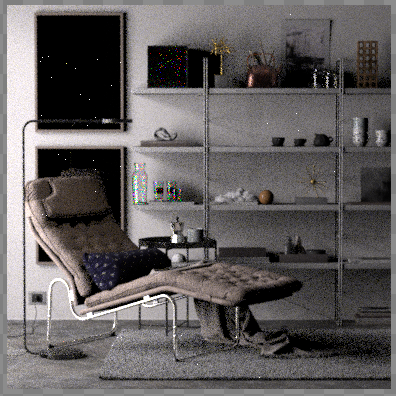

### pbrt-book

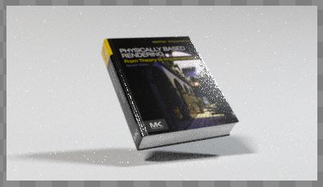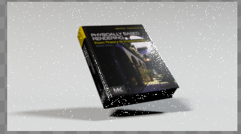

### sportscar-area

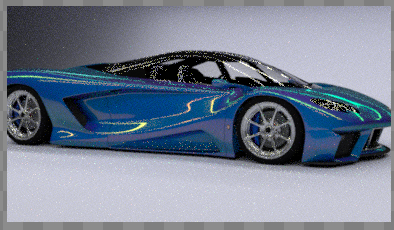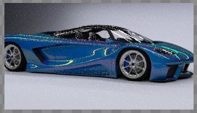

### sportscar-sky

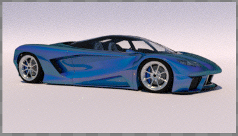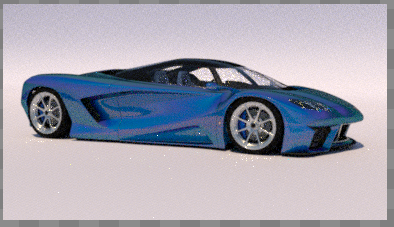

### watercolor-camera-1

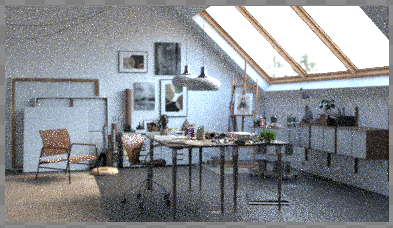

### zero-day-frame120

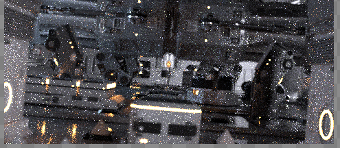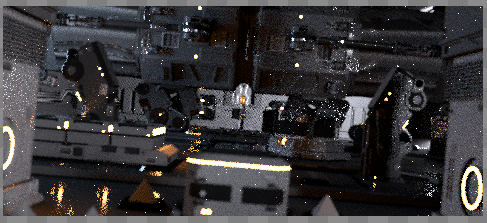
