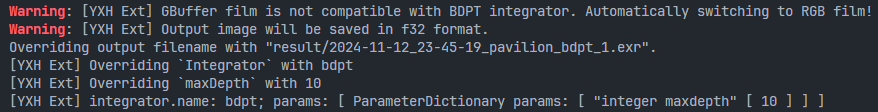

# PBRT v4 Customized

* 记一些和原版pbrt v4不同的行为
  * 所有积分器输出的数值精度均为f32
    * 在原pbrt中，只有sppm输出f32，其他所有积分器输出f16
  * 记不清了，大部分行为的变化都在终端的输出中有体现，请注意终端输出，如：
    * 

## 部署

* 我在一个服务器上的操作记录，懒得改了，记录一下

* 通过远程桌面复制黏贴：pbrt-v4.zip（提前recursive clone所有submodule）

* 通过远程桌面复制黏贴：benedikt-bitterli-scenes.zip

* 通过远程桌面复制黏贴：python安装包

  * https://www.python.org/ftp/python/3.12.8/python-3.12.8-amd64.exe

* 通过远程桌面复制黏贴：cmake安装包

  * https://github.com/Kitware/CMake/releases/download/v3.31.2/cmake-3.31.2-windows-x86_64.msi

* 安装vs：https://visualstudio.microsoft.com/zh-hans/

  * 需要安装
    * MSVC v143 - VS 2022 C++ x64/x86 生成工具(最新)
    * windows 10 sdk
      * 没有win10 sdk的话，会提示：No CMAKE_CXX_COMPILER could be found
  * 可能需要，在系统中添加环境变量：cl.exe所在路径 + vcvarsall所在路径
    * 注：这个操作不知道是否需要，推荐先不手动添加path试一下
  
* 手动在pbrt目录中，创建result文件夹

  * 不然pbrt会提示经典的No such xxxx（python脚本里没写创建文件夹的代码）
  
* 全部安装完毕后，进入pbrt-v4目录

  ```
  cmake -B build
  cmake --build build
  python ./data_maker.py
  ```