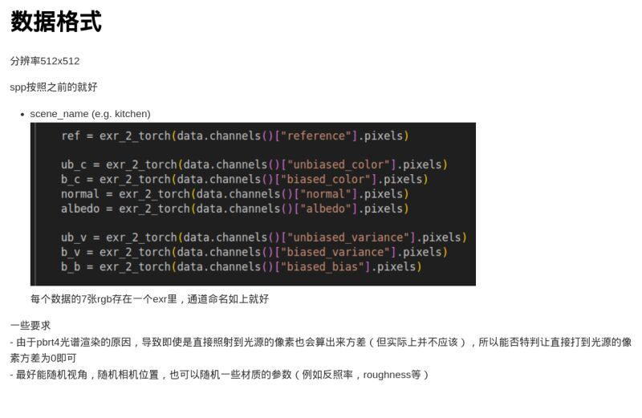

# data-analyzer

* Data Converter 1
  * 作用：将pbrt-v4/result/*.exr 文件进行重命名与格式调整
    * 重命名：去除时间戳，并且将_bdpt_*spp*去除
    * 格式调整：去除sppm中无用的通道
    * 输出路径：pbrt-v4/result/data-converter-output/*.exr
  * 使用方法
    * 使用 `python data_maker.py` 生成数据
    * 在当前目录下执行 `cargo run --bin data-converter-1`

* Data Converter 2
  * 作用：将pbrt-v4/result/data-converter-output/*.exr 文件进行重命名与格式调整
    * 按照最新需求图进行输出
      * 
    * 输出路径：pbrt-v4/result/data-converter-2-output/*.exr
